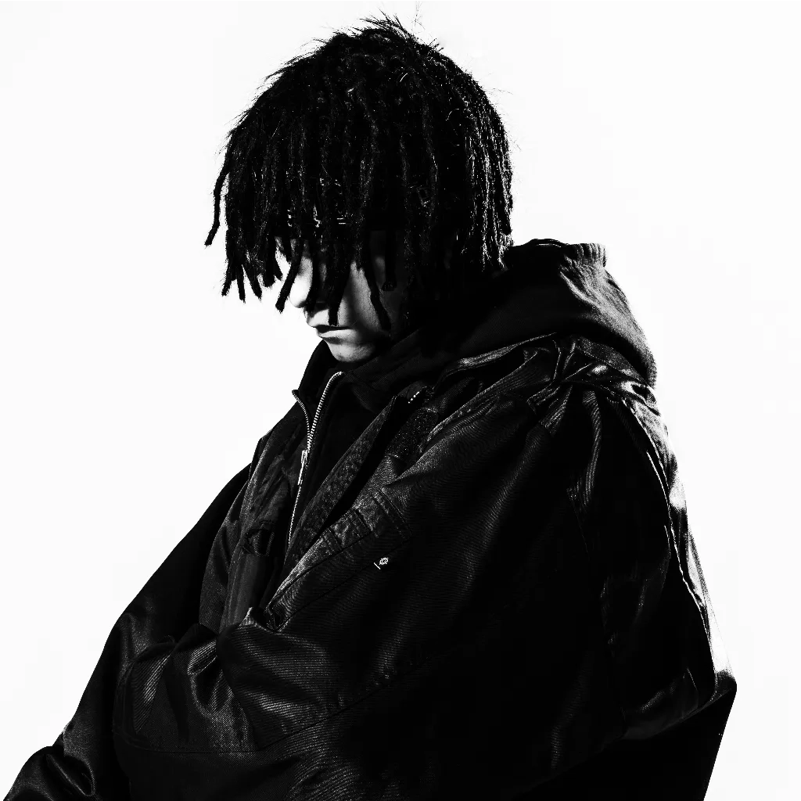
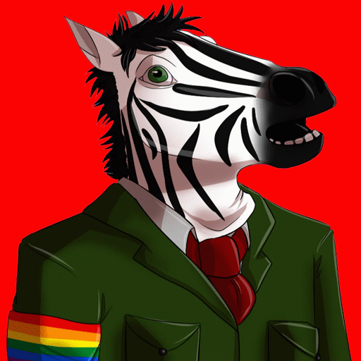
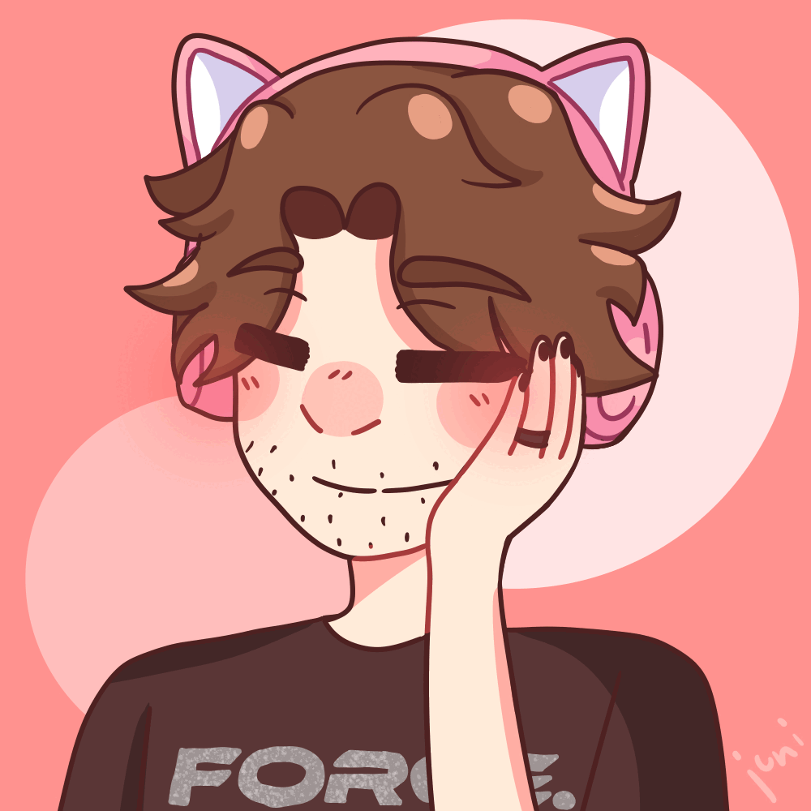
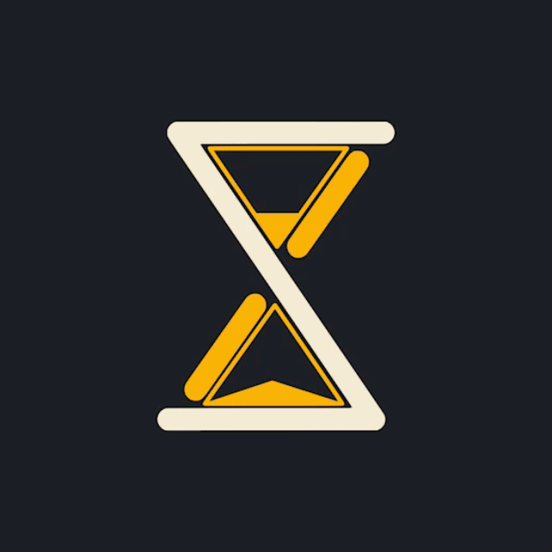

  

## Hello! 👋

  I have a lot of interests, and I'm learning new things all the time 🌱
  Technology, physics, and math are areas in which I feel proficient 💪
  Currently, I am extending my knowledge by studying Computer Science at the
  Polish-Japanese Academy of Information Technology. I graduated from the
  Faculty of Physics, Warsaw University of Technology ⚛️
    
  I also currently work as a software developer at Łukasiewicz Research
  Network – Institute of Aviation - Engineering Design Center(EDC). EDC is an
  engineering alliance between General Electric Company and Łukasiewicz Research
  Network – Institute of Aviation. 🚀✈️🛠
    
  In my free time, I like to develop my bots on Discord. Here is one of the verified ones: 
  <a href="https://discord.com/api/oauth2/authorize?client_id=697961565403611256&permissions=8&scope=applications.commands%20bot">
    click
  </a> 
  🤖
   

## Discord Communities that I work with 🤝

